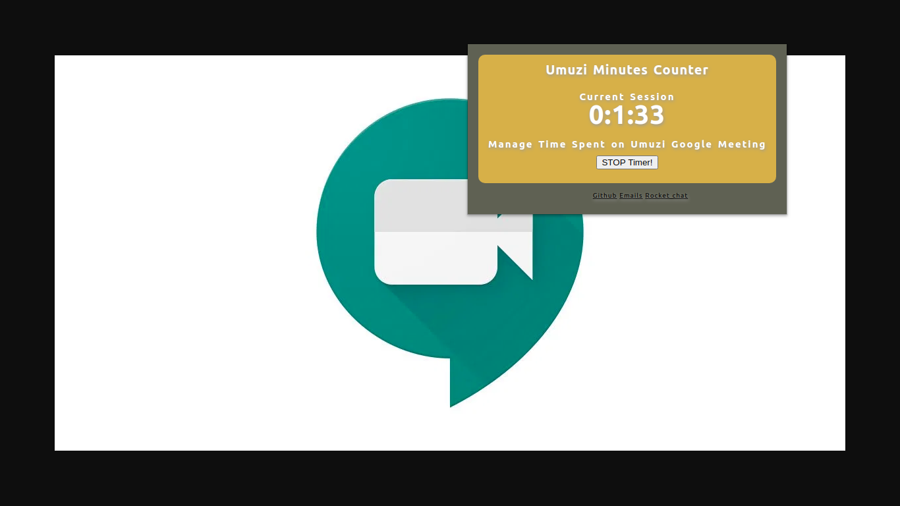

# Umuzi Google Meet Minute counter
- A simple chrome extension that will save the time spent on google meet meetings.
- On `https://chrome.google.com/webstore/category/extensions?hl=en-GB`, 
 search for `Umuzi Tools` extension and `Install` on your browser
- Press the Timer icon and record the time spent on the meeting
- ​
